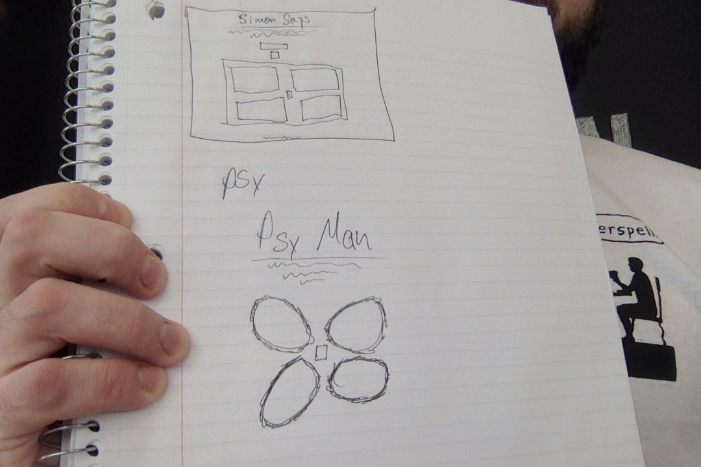
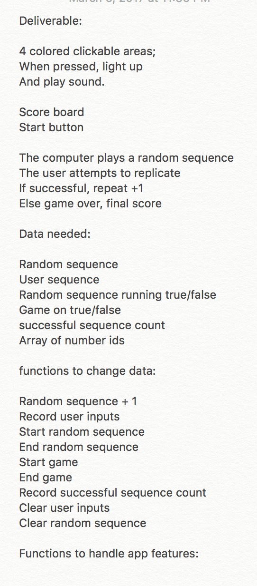

# Inception and Purpose

This project was developed for General Assembly's Web Development Intensive program.  This was the first project and an inndividual one.  The goal was to make a single page game.  The game I initially chose to make was Simon.  I finished Simon with some time to spare and decided to work on a second game, Connect Four.  I wanted the theme of these games to be relaxing, so I called the collection "Chill Games".

# Synopsis

In PerSimon (name due to the flower-like shape), a user chooses a difficulty level to begin the game and then attempts to replicate the computer's actions by clicking on the "petals" in the same sequence as the computer.  The final score is modified based on the difficulty level of the game.  The game keeps track of the top 5 high scores, though they do not persist past page refresh.  I put my own "spin" on the game with the expert level, where the game board spins around the center.

In KinectFour, a user can choose to play against another user locally or play against the AI I designed to play the game.  The game is played by each player alternating turns, choosing a valid move each turn.  A move is made by clicking on the column in which you would like to drop your piece, and it falls all the way to the bottom.  The winner is the first one to connect four of their pieces either vertically, horizontally, or diagonally.  The game keeps track of each player's total wins and has the ability to reset these numbers.  User's can also input their names in place of "Player 1" and "Player 2".  I am quite proud of the AI as it has beaten me a few times (though I'm not sure if that is a testament to its intelligence or my lack-there-of!).

# Planning

I used [Trello](https://trello.com/b/iZuQWMaL/simon) to keep myself organized and on track.

My initial wireframe:

My initial planning process:

# Technology Used

	* HTML5/CSS
	* Materialize CSS
	* JavaScript
	* Jquery
	* Github/Github Pages
	* Trello

# To Do

I would like to make the site more responsive, clean up the styling on KinectFour, persist the high scores on PerSimon, and adjust the audio levels.

# More On This Project and Me

I am a passionate problem solver and JavaScript coder.  The live page for this project can be found [HERE](https://liamtrobinson.github.io/Simon/index.html), so please go play a few games and let me know what you think!  If you are interested in learning more about me, you can check out my other repositories or visit my [profile page](http://gunner-lizard-82827.bitballoon.com/).  Thanks for reading and feel free to pull or give any feedback.